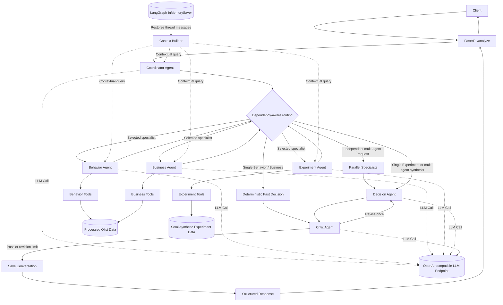

# Ecommerce Growth Agent

An evidence-grounded multi-agent analytics service for ecommerce growth decisions. The project routes natural-language questions to specialist agents for customer behavior, business performance, and A/B experiments; combines their structured findings; and sends the answer through a critic before returning it through FastAPI.

The system is built with LangGraph, LangChain, FastAPI, Pydantic, pandas, NumPy, and SciPy. It uses an OpenAI-compatible model endpoint configured through the `TOKENHUB_*` environment variables.

## Key capabilities

- Dynamic routing to behavior, business, and experiment specialists.
- A deterministic fast path for single Behavior or Business requests, avoiding an unnecessary Decision LLM call.
- Dependency-aware execution: independent specialists run concurrently, while Behavior-to-Business questions remain sequential when later analysis depends on discovered categories.
- Structured specialist, decision, and critic outputs validated with Pydantic.
- Tool-call pruning, stopping rules, and validation-aware retry guidance.
- Thread-scoped conversational memory through a LangGraph in-memory checkpointer.
- A critic/revision loop capped at one revision to prevent unbounded reflection.
- Structured JSON observability with per-node and end-to-end latency measurements plus secret redaction.
- A typed FastAPI interface, Docker image, GitHub Actions CI, unit tests, and reproducible evaluation scripts.

## Architecture



### Agent roles

| Component | Responsibility |
|---|---|
| Coordinator | Interprets the request, selects specialists in order, and explains the routing decision. |
| Behavior Agent | Analyzes repeat-customer profiles, delivery/review relationships, and category preferences. |
| Business Agent | Analyzes revenue trends, category rankings and declines, and average order value. |
| Experiment Agent | Evaluates conversion significance, confidence intervals, profit impact, and rollout decisions. |
| Decision Agent | Synthesizes multiple specialist reports or experiment decisions into a final structured recommendation. |
| Fast Decision | Deterministically maps one Behavior or Business report to the decision schema without another LLM call. |
| Critic Agent | Checks evidence fidelity, unsupported numbers, causal overreach, uncertainty, and recommendation consistency. |

## Routing and execution

The Coordinator returns an ordered list of specialists. The router then chooses one of three execution modes:

1. **Single-agent fast path:** one Behavior or Business specialist runs, then its report is converted directly into a `DecisionReport`. Experiment requests retain the full Decision Agent because rollout labels are business-critical.
2. **Sequential specialists:** questions in which Business analysis depends on Behavior findings run in dependency order and pass previous specialist context forward.
3. **Parallel specialists:** independent multi-agent requests execute concurrently in a thread pool, then flow into the Decision Agent.

Every path reaches the Critic. A material issue can trigger one Decision Agent revision; otherwise the workflow stores the response and finishes.

## Tools and data

The analytical tools are deterministic Python functions over local CSVs:

- `data/processed/customer_features.csv`
- `data/processed/order_summary.csv`
- `data/processed/order_facts.csv`
- `data/processed/daily_business_metrics.csv`
- `data/processed/category_monthly_metrics.csv`
- `data/synthetic/experiments.csv`

The processed tables are derived from the Brazilian ecommerce dataset published by Olist. Raw third-party files are intentionally excluded from Git. The experiment dataset is semi-synthetic and reproducible: `scripts/build_experiments.py` uses a fixed seed and real customer AOV distributions to generate three controlled experiments.

Tool inputs are checked for valid date ranges, required columns, positive limits, known experiment IDs, and supported categories or frequencies. Recoverable tool errors are returned as structured guidance rather than silently producing a result.

## API

### `GET /health`

Returns:

```json
{"status": "ok"}
```

### `POST /analyze`

Request:

```json
{
  "query": "Which categories do repeat customers prefer, and are those categories performing well in revenue?",
  "thread_id": "demo-thread"
}
```

`thread_id` is optional. Reusing it preserves conversation context within the current process. The response includes the selected and completed agents, structured decision, critic verdict, safe errors, per-node latency trace, run ID, and total workflow latency.

Interactive API documentation is available at `http://localhost:8000/docs` while the server is running.

## Observability

Workflow and API events are written to standard output as one-line JSON. Summaries include:

- run and thread identifiers;
- selected and completed agents;
- critic verdict and revision count;
- per-node and end-to-end latency;
- safe error metadata.

Values under secret-like keys, configured secret values, bearer tokens, and common key formats are redacted before logging. Raw tracebacks are not exposed by the API.

## Evaluation

The evaluation suite contains 20 single-turn cases:

- 4 Behavior cases;
- 5 Business cases;
- 5 Experiment cases;
- 6 multi-agent cases.

Two additional two-turn scenarios evaluate follow-up memory. Metrics cover routing, workflow completion, critic behavior, experiment recommendations, memory follow-ups, errors, specialist-call count, end-to-end latency, and node latency.

The committed results are historical snapshots produced with an online model endpoint. Latency varies with network and provider conditions; this is a reproducible functional benchmark, not a production load test or a claim of statistical generalization.

### Final benchmark

| Metric | Historical baseline | Final | Change |
|---|---:|---:|---:|
| Single-turn cases | 20 | 20 | — |
| Routing accuracy | 100% | 100% | maintained |
| Workflow success | 95% | 100% | +5 pp |
| Recommendation accuracy | 100% | 100% | maintained |
| Memory follow-up accuracy | 100% | 100% | maintained |
| Critic pass rate | 100% | 100% | maintained |
| Critic revision rate | 10% | 0% | -10 pp |
| Error rate | 0% | 0% | maintained |
| Average specialist calls | 1.30 | 1.30 | maintained |
| Average latency | 48.3261 s | 23.1415 s | **52.1% lower** |
| P95 latency | 118.2926 s | 48.1717 s | **59.3% lower** |

The baseline is intentionally preserved. Its 95% workflow success reflects the historical M06 failure caused by an invalid AOV tool parameter; it was not retroactively changed after the validation fix.

Node-level averages also improved:

| Node | Baseline | Final | Reduction |
|---|---:|---:|---:|
| Coordinator | 2.86 s | 2.54 s | 11.0% |
| Behavior Agent | 26.48 s | 15.09 s | 43.0% |
| Business Agent | 31.88 s | 11.40 s | 64.2% |
| Experiment Agent | 17.52 s | 9.48 s | 45.9% |
| Decision Agent | 7.19 s | 4.96 s | 31.1% |
| Critic Agent | 3.99 s | 3.40 s | 14.9% |

See the [benchmark comparison](evaluation/results/benchmark_comparison.json), [baseline workflow snapshot](evaluation/results/baseline_workflow_results.json), and [final workflow snapshot](evaluation/results/workflow_results.json) for the committed evidence.

### Performance engineering

- **Single-agent fast path:** nine single-agent Behavior/Business cases skipped the Decision LLM while retaining critic verification.
- **Tool-call pruning and stopping rules:** each specialist selects the narrowest analytical tool, avoids duplicate calls, and stops once evidence is sufficient.
- **Dependency-aware concurrency:** independent specialists run concurrently; dependent Behavior-to-Business requests remain ordered.
- **Robust tool validation:** invalid arguments fail clearly and permit at most one targeted correction instead of exploratory retries.

## Project structure

```text
ecommerce-growth-agent/
├── .github/workflows/ci.yml       # GitHub Actions test workflow
├── app/
│   ├── agents/                    # Coordinator, specialists, decision, critic
│   ├── graph/                     # State, memory, routing, LangGraph workflow
│   ├── observability/             # Structured logging and redaction
│   ├── schemas/                   # Pydantic contracts
│   ├── tools/                     # Deterministic analytics tools
│   ├── config.py                  # OpenAI-compatible endpoint configuration
│   └── main.py                    # FastAPI application
├── data/
│   ├── processed/                 # Runtime Olist-derived tables
│   ├── raw/                       # Local only; excluded from Git
│   └── synthetic/                 # Reproducible experiment data
├── evaluation/
│   ├── results/                   # Canonical baseline/final snapshots
│   ├── evaluate_routing.py
│   ├── evaluate_workflow.py
│   ├── metrics.py
│   └── test_cases.json
├── scripts/                       # Data build and provider-check utilities
├── tests/                         # 38 automated tests
├── .dockerignore
├── .env.example
├── .gitignore
├── Dockerfile
├── pyproject.toml
└── requirements.txt
```

## Setup

Python 3.12 is used locally, in Docker, and in CI.

```bash
python -m venv .venv
```

Activate the environment on Windows PowerShell:

```powershell
.\.venv\Scripts\Activate.ps1
```

Or on macOS/Linux:

```bash
source .venv/bin/activate
```

Install dependencies:

```bash
python -m pip install --upgrade pip
python -m pip install -r requirements.txt
```

Create a local environment file from `.env.example` and set:

```dotenv
TOKENHUB_API_KEY=your_api_key
TOKENHUB_BASE_URL=your_openai_compatible_base_url
TOKENHUB_MODEL=your_model_name
```

Never commit `.env` or real credentials.

## Run locally

```bash
python -m uvicorn app.main:app --reload
```

Then open `http://localhost:8000/docs` or call the API directly:

```bash
curl -X POST http://localhost:8000/analyze \
  -H "Content-Type: application/json" \
  -d '{"query":"Should we roll out EXP002?","thread_id":"demo"}'
```

## Run with Docker

```bash
docker build -t ecommerce-growth-agent .
docker run --rm -p 8000:8000 --env-file .env ecommerce-growth-agent
```

The image runs as a non-root user and includes a health check against `/health`. Raw data, tests, evaluation outputs, local environments, and secrets are excluded from the build context.

## Run tests

```bash
python -m pytest -q
```

Expected result:

```text
38 passed
```

The tests cover the API contract, analytical tools, routing modes, fast path, memory isolation, observability, and secret redaction. They mock workflow calls where appropriate and do not require an API key.

## Run the benchmark

Routing only:

```bash
python -m evaluation.evaluate_routing
```

Full workflow and memory evaluation:

```bash
python -m evaluation.evaluate_workflow
```

The full evaluation calls the configured online model and may incur cost. It overwrites `evaluation/results/workflow_results.json`; preserve any result you intend to compare before rerunning it.

## Rebuild the data

The repository includes the processed tables needed at runtime. To reproduce them, place the Olist CSV files under `data/raw/olist/`, then run:

```bash
python -m scripts.build_analytics_tables
python -m scripts.build_feature_tables
python -m scripts.build_experiments
```

You can inspect the raw datasets before building with:

```bash
python -m scripts.inspect_olist
```

To verify access to the configured model provider without running the benchmark:

```bash
python -m scripts.check_tokenhub
```

## CI

GitHub Actions installs the pinned direct dependencies, checks dependency consistency, and runs the 38-test suite on Python 3.12 for every push and pull request.

## Security and secrets

- `.env`, local environment variants, logs, caches, and virtual environments are ignored by Git.
- The Docker build context excludes secrets and development-only directories.
- Logs redact configured secret values and common credential patterns.
- API failures return a generic message instead of provider details.
- This demonstration API has no authentication or rate limiting; add both before exposing it publicly.

## Limitations and next steps

- Conversation memory is process-local and is lost on restart; a durable checkpointer is needed for production.
- Dependency detection currently combines Coordinator ordering with explicit routing heuristics; a richer task-dependency representation would generalize better.
- Analytics run on local CSVs, which is appropriate for this dataset but not for large or continuously updated data.
- The 20-case benchmark is compact and model/provider latency is variable. Repeated runs, confidence intervals, and load testing would strengthen performance claims.
- Production deployment would also need authentication, rate limits, request tracing, durable storage, and monitoring integration.
